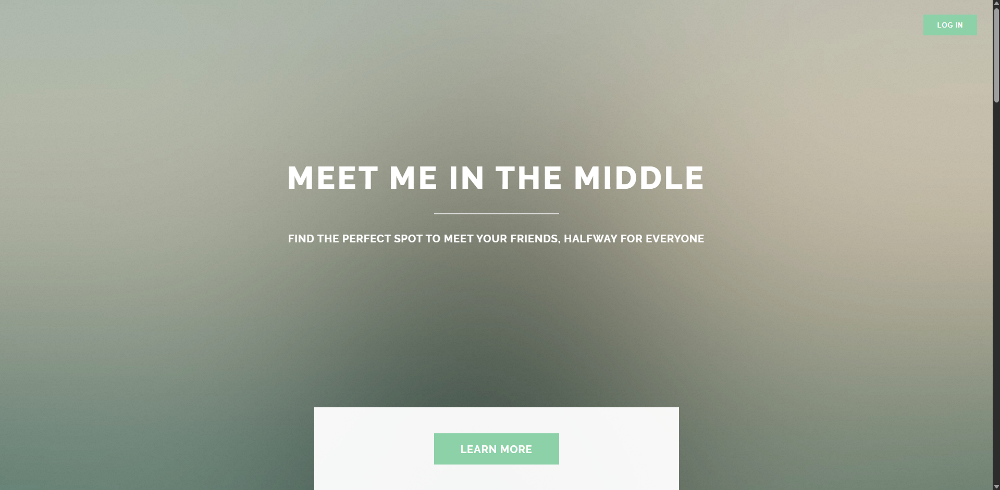
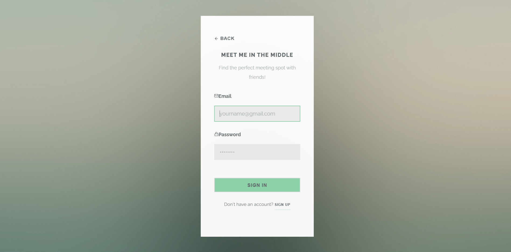
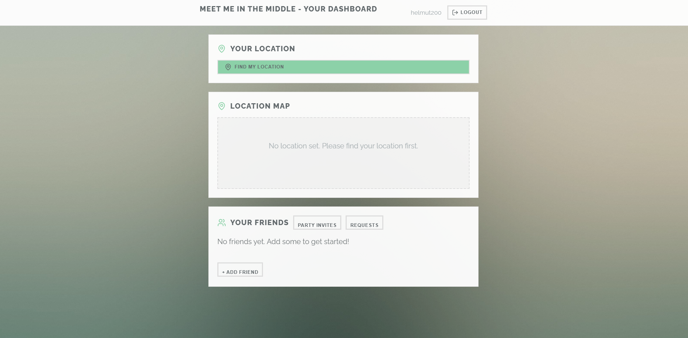
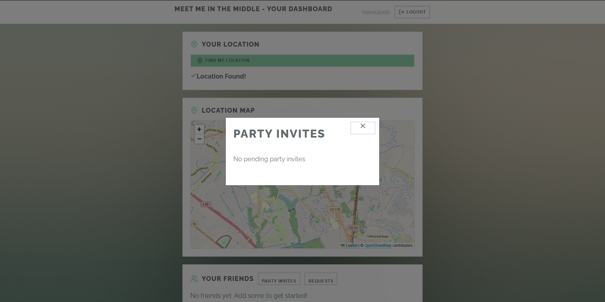
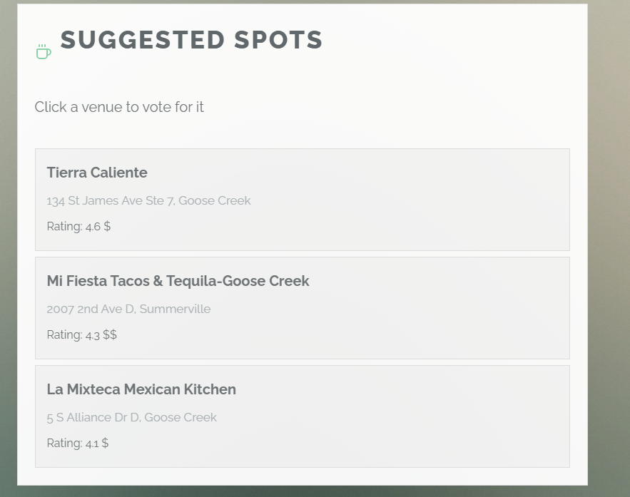

[Back to Portfolio](./)

Meet Me In the Middle
===============

-   **Class:**  CSCI 499
-   **Grade:** NA
-   **Language(s):** Python, JS, SQL, CSS
-   **Source Code Repository:** [Source Code:](https://github.com/Helmut34/CSU-Senior-Project-Meet-Me/)  
    (Please [email me](mailto:helmut.cespedes@gmail.com?subject=GitHub%20Access) to request access.)

## Project description

Coordinating group meetups is difficult when each person is spread across different locations. The main problems include people not wanting to travel and never being able to decide on a spot. This app aims to aid in the whole process by calculating a fair midpoint and provided venues based on everyone's preferences. 

## How to run the program

Deployed Application

## UI Design

The users can create accounts, add friends, share their locatins, and the application finds a fair midpoint for them.

  
Fig 1. The Landing page

  
Fig 2. Example showing the Login Page .

  
Fig 3. Example showing the Dashboard.

  
Fig 4. Example showing the party invite modal.

  
Fig 5. Example Showing Suggested Spots

For more details see [GitHub Flavored Markdown](https://github.com/Helmut34/CSU-Senior-Project-Meet-Me/blob/master/docs/Meet%20Me%20In%20The%20Middle.pdf).

[Back to Portfolio](./)